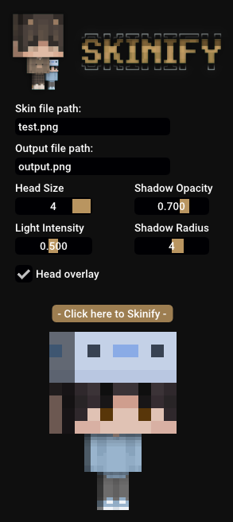

  
    
  
<b>Turn your Minecraft skin into whatever this is</b> ~ Made by Jonas

  
  

  

## ⚡️ Features
- Create your own skin thingy with only one click
- Customize:
  - [x] Head size
  - [x] Shadow & Light appearance
  
## 🖥 Preview

---

## ⭐️ Made by Jonas#1713

### If you want to say **thank you** or/and support active development of this wonderful project:

- Add a **[GitHub Star](https://github.com/jonas-mtl/Skinify/)** to the project.
- Share with your friends if you like this project.
- Add me on Discord for feedback & questions

